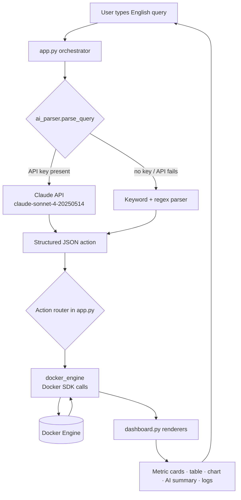
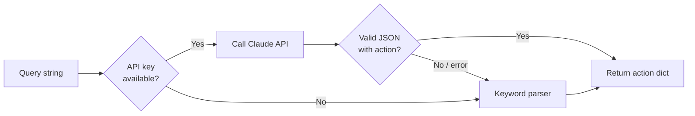
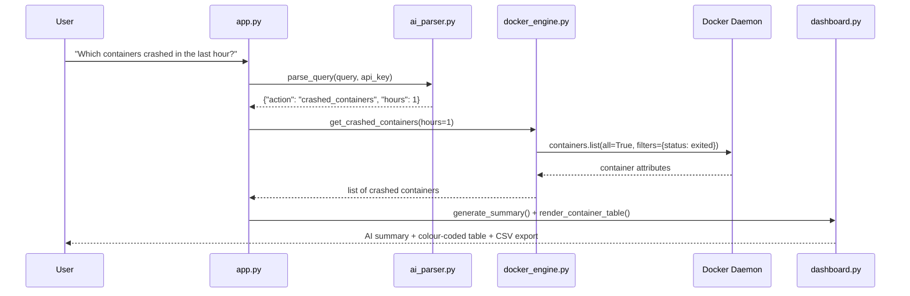

# 🐳 Docker NL Health Dashboard

**Talk to your Docker containers in plain English — no terminal required.**

A natural-language operations dashboard that lets anyone ask questions like *"Which containers crashed in the last hour?"* or *"Show logs of nginx"* and get back clean, visual answers — without typing a single `docker` command.

Submission for **Infinite Computer Solutions** · AI-Assisted Development Hackathon

---

## Problem Statement

Modern applications run inside Docker containers. When a container fails or restarts in a loop, engineers diagnose it with terminal commands such as:

```bash
docker ps -a --filter "status=restarting"
docker logs <container> --tail 50
```

This workflow assumes the operator knows Docker CLI syntax, status filters, and log flags. Non-technical users — support staff, QA, junior developers, founders — are effectively locked out of container health information, even though they often need it most during an incident.

## Business Impact

- **Lower mean-time-to-diagnosis.** Anyone on the team can check container health during an incident instead of waiting for an engineer to translate the question into CLI flags.
- **Reduced operational dependency.** Routine "is everything up?" and "what crashed?" checks no longer require terminal access or Docker expertise.
- **Faster onboarding.** New team members become productive on container monitoring on day one, using English instead of memorising command syntax.
- **A single visual surface.** Health counts, status distribution, crash detection, and logs are consolidated into one dashboard rather than scattered across CLI invocations.

## Proposed Solution

The dashboard implements a three-phase pipeline that mirrors how a human would handle the request:

1. **Translate** — A natural-language query is converted into a structured JSON action (e.g. `{"action": "crashed_containers", "hours": 1}`). This is done by the Anthropic Claude API when an API key is supplied, and by a deterministic keyword/regex parser as a zero-dependency fallback.
2. **Execute** — The structured action is routed to the Docker Engine via the official Docker SDK for Python (`docker.from_env()`), which lists containers, reads state, computes uptime, and fetches logs.
3. **Present** — Results are rendered as metric cards, a colour-coded container table, a status-distribution bar chart, and a plain-English summary, all inside a Streamlit web UI. Results can be exported to CSV and logs downloaded as text.

---

## Features

All features below are implemented in the source code (`Source Code/`):

- **Natural-language query box** — Ask questions in English; intent is detected and shown back to the user before execution.
- **Dual parsing engine** — Claude API parsing (`claude-sonnet-4-20250514`) with automatic fallback to a local keyword parser, so the app works with *or* without an API key.
- **Live container inventory** — Lists containers by status: running, exited (stopped), restarting, paused, created, dead.
- **Crash detection over a time window** — Finds containers that exited within the last *N* hours, including exit codes and restart counts.
- **Container counting** — Answers "how many" questions filtered by status.
- **Log viewer** — Fetches the last *N* timestamped log lines for a named container, with a download button.
- **Health overview** — Aggregate stats (total / running / stopped / restarting / unhealthy) plus a status-distribution bar chart.
- **Container search** — Finds containers by name or image substring.
- **Quick Actions sidebar** — One-click common queries and a live Docker connectivity indicator.
- **Query history** — Recent queries are stored in session and re-runnable from the sidebar.
- **Parsed-intent transparency** — A JSON expander shows exactly how each query was interpreted.
- **CSV / log export** — Results and logs are downloadable.
- **Graceful Docker-offline handling** — A clear remediation panel appears when the daemon is unreachable.

---

## Architecture Overview

The codebase is cleanly separated into four modules with single responsibilities:

| Module | Responsibility |
|---|---|
| `app.py` | Streamlit entry point, page styling, query orchestration, action routing |
| `ai_parser.py` | NL → structured-JSON translation (Claude API + keyword fallback) |
| `docker_engine.py` | All Docker SDK operations: list, logs, stats, crash detection, uptime |
| `dashboard.py` | All UI rendering: metric cards, tables, charts, log viewer, summaries, sidebar |

### High-level flow



### Parsing fallback logic



### Request lifecycle (sequence)



---

## Tech Stack

| Layer | Technology |
|---|---|
| Language | Python 3.10+ |
| Web UI | Streamlit |
| AI / NLU | Anthropic Claude API (`claude-sonnet-4-20250514`) |
| Container integration | Docker SDK for Python (`docker`) |
| Data handling | pandas |
| Fallback NLU | Python `re` (regex) + keyword matching (standard library) |
| Live refresh (optional) | `streamlit-autorefresh` |

The stack was identified directly from the `import` statements and API calls in the source files.

---

## Setup Instructions

**Prerequisites**

- Python 3.10 or newer
- Docker Engine / Docker Desktop installed and running (the dashboard reads from the local daemon)
- *(Optional)* An Anthropic API key for AI-powered parsing

**Steps**

```bash
# 1. Clone the repository
git clone <your-public-repo-url>
cd <repo>/"Source Code"

# 2. (Recommended) create a virtual environment
python -m venv venv
# Windows:
venv\Scripts\activate
# macOS / Linux:
source venv/bin/activate

# 3. Install dependencies
pip install -r requirements.txt
```

**Optional — enable AI parsing**

Provide the key either via environment variable or in the app sidebar at runtime.

```bash
# macOS / Linux
export ANTHROPIC_API_KEY="sk-ant-..."
# Windows (PowerShell)
setx ANTHROPIC_API_KEY "sk-ant-..."
```

If no key is provided, the app automatically uses the built-in keyword parser — no configuration needed.

## Run Instructions

```bash
# From the "Source Code" directory, with Docker running:
streamlit run app.py
```

Streamlit opens the dashboard in your browser (default `http://localhost:8501`).

Try these queries:

- `Show all running containers`
- `Which containers crashed in the last hour?`
- `Show logs of nginx`
- `How many containers are active?`
- `Show docker health overview`

If Docker is not running, the app displays a remediation panel instead of crashing.

---

## Folder Structure

```
Project Repository
│
├── README.md                     # This file
├── Demo Video Link.txt           # Blank — paste the Google Drive link before final submission
├── AI_Usage_Note.md              # One-page AI usage report
├── Prompt_Documentation.md       # Key development prompts (Claude, Google AI Studio, Antigravity)
├── .gitignore
│
├── Team Members Resume/          # All four resumes in PDF
│   ├── Akash_K.pdf
│   ├── Salman_Khan_S.pdf
│   ├── Varun_Kumar_M.pdf
│   └── Yogesh_S.pdf
│
├── Sample_Data/                  # Representative inputs + expected outputs
│   ├── README.md
│   ├── sample_queries.txt
│   ├── container_status.json
│   ├── expected_results.json
│   └── ai_responses.json
│
├── Test_Cases/                   # Automated pytest suite + documented test matrix
│   ├── README.md
│   ├── test_ai_parser.py
│   ├── test_docker_engine.py
│   ├── test_dashboard.py
│   └── Test_Case_Matrix.md
│
├── Supporting_Documents/         # Deeper-dive docs for evaluators
│   ├── Architecture_Explanation.md
│   ├── Assumptions_and_Limitations.md
│   └── Repository_Audit_Report.md
│
└── Source Code/                  # The application
    ├── app.py
    ├── ai_parser.py
    ├── docker_engine.py
    ├── dashboard.py
    └── requirements.txt
```

---

## Assumptions

- The dashboard runs on a host where the **Docker daemon is reachable locally** via `docker.from_env()` (Docker Desktop or a Unix socket). It reports on the local Docker environment, not a remote cluster.
- "**Crashed**" is interpreted as a container in the `exited` state whose `FinishedAt` timestamp falls within the requested look-back window. Exit code is surfaced but not used to filter.
- "**Stopped**" maps to Docker's `exited` status; "**active**" maps to `running`.
- The **AI parser is optional**. Where no API key is present, the keyword/regex parser provides deterministic coverage of the documented query set.
- Docker timestamps are treated as **UTC** when computing uptime and crash windows.
- The application is **read-only** — it observes and reports container state; it does not start, stop, or modify containers.

## Limitations

- **Local daemon only** — remote Docker hosts, Swarm, and Kubernetes are out of scope.
- **Read-only** — no lifecycle control (start/stop/restart) by design, to keep the tool safe for non-technical users.
- **Keyword fallback is bounded** — without an API key, only the documented query patterns are recognised; truly free-form phrasing benefits from the Claude API.
- **Crash detection depends on retained containers** — containers removed with `--rm` leave no record to inspect.
- **Log volume** — the viewer fetches a bounded tail (default 50 lines); it is not a full log-aggregation system.
- **Single-host scope** — there is no multi-node aggregation or historical time-series storage.

---

## Screenshots

The repository includes visual evidence of the working application. Reviewers can find the dashboard's hero header, metric cards, natural-language query box, parsed-intent JSON view, colour-coded results table, status-distribution chart, and log viewer in the recorded demonstration (link in `Demo Video Link.txt`) and in the attached project screenshots.

> The live UI renders a dark, Docker-themed dashboard: a shimmering top border, five metric cards (Total / Running / Stopped / Restarting / Unhealthy), the English query box with example chips, and a colour-coded container table where running rows are tinted green, exited rows red, and restarting rows amber.

*(The 5–7 minute walkthrough video will be linked in `Demo Video Link.txt` prior to final submission.)*

---

## Evaluation Criteria Mapping

| # | Evaluation Area | Where it is demonstrated |
|---|---|---|
| 1 | **Ship working code using AI assistants** | End-to-end runnable Streamlit app (`Source Code/`); AI assistance documented in `AI_Usage_Note.md` and `Prompt_Documentation.md` |
| 2 | **Hands-on skill building AI agents** | `ai_parser.py` implements an LLM-driven intent agent: a system prompt defines a structured action space, the model output is parsed into JSON, and `app.py` routes it to tools — a translate → act loop |
| 3 | **Building or consuming MCP / tool use** | The parser turns language into a structured tool-call schema that the engine layer executes against the Docker SDK — the same consume-a-structured-tool pattern MCP formalises (see `Supporting_Documents/Architecture_Explanation.md`) |
| 4 | **Service / API integration** | Two integrations: the **Anthropic Claude API** (`ai_parser._parse_with_ai`) and the **Docker Engine API** via the Docker SDK (`docker_engine.py`) |
| 5 | **End-to-end execution & usability** | Full pipeline from English query → Docker call → visual answer; graceful offline handling; CSV/log export; quick actions; query history |
| 6 | **Code quality, documentation, demonstration** | Modular four-file architecture, docstrings throughout, typed signatures, this README, supporting docs, and an automated test suite in `Test_Cases/` |

### Mandatory AI capability

The project satisfies **all three** optional capabilities (only one was required):

- **Agent loop** — query → AI intent extraction → tool routing → execution → summarised response.
- **Tool/MCP-style consumption** — structured action schema consumed and executed against the Docker SDK.
- **External API / service integration** — Anthropic Claude API + Docker Engine API.

---

## Future Enhancements

- Container lifecycle actions (start / stop / restart) behind a confirmation guard.
- Remote and multi-host support (Docker contexts, Swarm, Kubernetes).
- Conversational follow-ups ("now show its logs") with retained context.
- Persistent history and time-series health trends.
- Alerting / webhook notifications on crash-loop detection.
- A formal MCP server exposing the Docker tools to any MCP-compatible client.

---

## Responsible AI Acknowledgement

AI coding assistants (Claude, Google AI Studio, and Antigravity) were used during development for scaffolding, refactoring, and documentation, as detailed in `AI_Usage_Note.md` and `Prompt_Documentation.md`. At runtime, the Claude API is used only to translate user phrasing into a constrained, auditable JSON action schema — every interpreted intent is shown to the user before execution, and the application is strictly read-only against the Docker daemon. No personal data is collected, and the tool functions fully without any AI service via its deterministic fallback parser. **Final implementation decisions, testing, validation, and integration were performed by the student team.**
