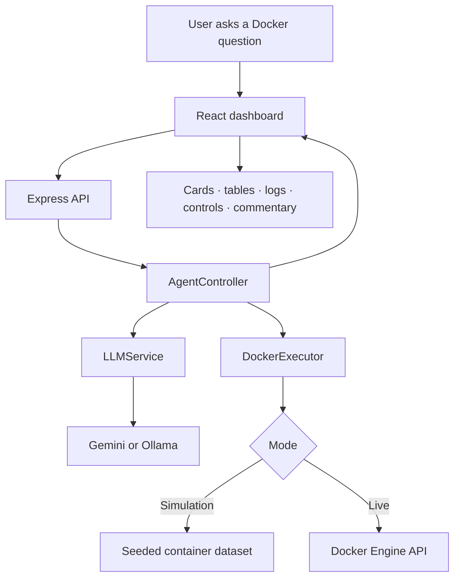
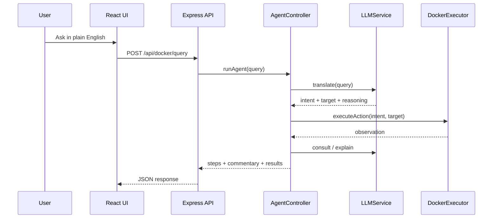

# 🐳 Docker NL Health Dashboard

**A full-stack Docker operations dashboard with natural-language querying, live container controls, and simulation mode for demos.**

This repository now contains the updated application version built with **React + Vite + Express + TypeScript**. The app lets a team inspect container health, run natural-language diagnostics, switch between **simulation** and **live Docker** modes, and perform guarded container actions from a single interface.

Submission for **Infinite Computer Solutions — AI-Assisted Development Hackathon**

---

## What changed in this version

- The previous Python/Streamlit implementation has been replaced with the updated TypeScript application in `Source Code/`.
- The source now includes a Vite frontend, an Express server, Docker Engine integration via `dockerode`, and dual LLM support for **Gemini** and **Ollama**.
- Repository documentation has been updated to reflect the new app and to refer to work completed **by the team**.

## Core capabilities

- **Natural-language Docker diagnostics** powered by a structured intent pipeline.
- **Dual LLM provider support** with Gemini as the cloud option and Ollama as the local or remote option.
- **Simulation mode** with seeded containers and fluctuating metrics for demos and offline review.
- **Live Docker mode** for connecting to a Docker Engine endpoint such as `http://127.0.0.1:2375`.
- **Container controls** for start, stop, and restart actions.
- **Container logs and runtime inspection** directly inside the dashboard.
- **Images, engine information, and summary metrics** presented in a single UI.
- **Safety guardrails** around destructive or unsupported operations.

---

## Updated architecture

The application is organized into a frontend shell, an Express API layer, and focused backend services:

| Module | Responsibility |
|---|---|
| `Source Code/src/App.tsx` | Main React dashboard, filters, panels, control flows, and natural-language UI |
| `Source Code/server.ts` | Express server, API routing, Vite dev integration, and production serving |
| `Source Code/src/server/dockerExecutor.ts` | Docker data access, simulation state, logs, metrics, and lifecycle actions |
| `Source Code/src/server/llmService.ts` | Gemini/Ollama intent translation, fallbacks, and commentary generation |
| `Source Code/src/server/agentController.ts` | Multi-step agent loop that plans, executes, observes, and summarizes |

### High-level flow



### Agent loop



---

## Tech stack

| Layer | Technology |
|---|---|
| Frontend | React 19 + Vite |
| Backend | Express + TypeScript |
| Docker integration | `dockerode` |
| AI providers | Google Gemini (`@google/genai`) and Ollama |
| Icons / UI motion | `lucide-react`, `motion` |
| Build tooling | Vite, esbuild, tsx |

---

## Setup

### Prerequisites

- Node.js 18+ recommended
- npm
- Docker Desktop or Docker Engine if you want to use live mode
- Optional: a Gemini API key
- Optional: a reachable Ollama instance

### Install

```bash
git clone https://github.com/VARUVK/Docker_NL_Dashboard.git
cd Docker_NL_Dashboard/Source\ Code
npm install
```

### Environment

Copy `Source Code/.env.example` to a local env file such as `.env.local` or `.env`, then set the values you need:

```bash
GEMINI_API_KEY=your_key_here
OLLAMA_URL=http://127.0.0.1:11434
OLLAMA_MODEL=llama3
```

### Run locally

```bash
npm run dev
```

The application runs on `http://localhost:3000`.

### Production build

```bash
npm run build
npm start
```

---

## Suggested demo flows

- Ask: `Which containers are unhealthy right now?`
- Ask: `Show logs for auth-api`
- Ask: `Which container is using the most CPU?`
- Switch between **Simulation** and **Live** mode
- Change the active LLM provider between **Gemini** and **Ollama**
- Start, stop, or restart a container from the dashboard controls

---

## Repository structure

```text
.
├── README.md
├── Demo Video Link.txt
├── AI_Usage_Note.md
├── Prompt_Documentation.md
├── .gitignore
├── Team Members Resume/
├── Sample_Data/
├── Test_Cases/
├── Supporting_Documents/
└── Source Code/
    ├── package.json
    ├── package-lock.json
    ├── server.ts
    ├── vite.config.ts
    ├── tsconfig.json
    ├── .env.example
    ├── src/
    └── assets/
```

---

## Submission notes

- The source of truth for the updated application is `Source Code/`.
- The demo video link is stored in `Demo Video Link.txt`.
- AI usage details are documented in `AI_Usage_Note.md` and `Prompt_Documentation.md`.
- Additional architecture, assumptions, and audit notes are in `Supporting_Documents/`.

---

## Team ownership

AI tools were used to accelerate drafting, prototyping, and refinement, but **the team reviewed, validated, integrated, and finalized the repository contents**.
