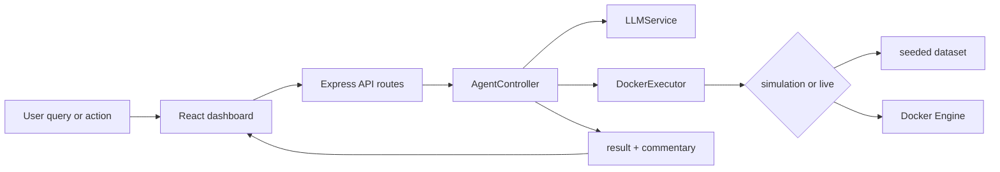

# Architecture Explanation

This note explains the architecture of the updated Docker NL Health Dashboard and how the current codebase fits together.

## Design principle: query → interpret → execute → explain

The updated app keeps a clear separation between:

1. **User interaction** in the React dashboard
2. **Intent translation** through the LLM service
3. **Execution** through the Docker service layer
4. **Explanation and presentation** back in the UI

That separation helps keep the application understandable, testable, and safer to operate.

## Main modules

- **`Source Code/src/App.tsx`**  
  The main UI container. It loads dashboard data, triggers natural-language queries, opens logs and inspection panels, and drives control actions such as start, stop, and restart.

- **`Source Code/server.ts`**  
  The server entrypoint. It binds the Express API and the Vite application together on port `3000`, exposes health and Docker routes, and serves the built frontend in production.

- **`Source Code/src/server/dockerExecutor.ts`**  
  The Docker execution layer. It stores the simulation dataset, handles live Docker Engine access through `dockerode`, computes summaries and metrics, retrieves logs, and performs supported container actions.

- **`Source Code/src/server/llmService.ts`**  
  The language layer. It translates natural-language requests into structured intents, selects between Gemini and Ollama, checks provider availability, and generates explanatory commentary.

- **`Source Code/src/server/agentController.ts`**  
  The orchestration layer. It runs the multi-step loop that translates a query, executes a candidate action, records observations, and produces a final explanation for the UI.

## Why simulation mode matters

The current app supports both **simulation** and **live** operation:

- **Simulation mode** gives the team a predictable environment for demos, screenshots, and basic walkthroughs.
- **Live mode** connects to a reachable Docker Engine endpoint and surfaces real state, logs, images, and control actions.

This makes the app usable even when a Docker host is not available during review.

## AI capability coverage

- **Agent loop**  
  The application interprets the query, executes one or more bounded actions, and returns structured observations plus commentary.

- **External service integration**  
  The app integrates with **Gemini**, **Ollama**, and the **Docker Engine API**.

- **Structured tool-style execution**  
  The LLM does not call Docker directly. It first produces a structured intent, and the backend executes that intent through explicit service code.

## Safety model

- The backend exposes only explicit routes.
- Container lifecycle actions are limited to supported operations.
- Unsupported or unsafe actions are blocked or routed to a guarded response.
- Provider failures degrade gracefully through fallbacks instead of crashing the UI.
