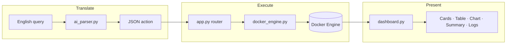

# Architecture Explanation

A deeper look at how the Docker NL Health Dashboard is structured and how it satisfies the hackathon's AI-capability requirements.

## Design principle: translate → execute → present

The system never lets the language model touch Docker directly. Instead it constrains the LLM to a single, safe job — turning English into a small, fixed JSON action — and then deterministic Python code executes that action. This keeps the tool auditable (every interpreted intent is shown to the user) and safe (the action space is closed and read-only).

## Module responsibilities

- **`ai_parser.py`** — The intelligence boundary. Holds the system prompt defining the action space, calls the Claude API when a key is present, strips stray markdown fences, validates the JSON, and falls back to a regex/keyword parser otherwise. Both paths emit the *same* schema.
- **`docker_engine.py`** — The integration boundary. Wraps the Docker SDK: client creation with a ping health check, container listing with enriched attributes (uptime, health, ports, restart count), bounded log retrieval, crash detection over a time window, and aggregate stats. Every function degrades gracefully to an empty/safe value when the daemon is unreachable.
- **`app.py`** — The orchestrator. Renders the page, captures the query, calls the parser, routes the resulting action to the right engine function, and hands results to the renderers. Contains the offline guard and CSV export.
- **`dashboard.py`** — The presentation boundary. Pure rendering: metric cards, the colour-coded table, the status-distribution chart, the log viewer, the plain-English summary, the sidebar, and the offline panel.

## How the AI-capability requirements are met

**Agent loop.** `ai_parser` + `app` form a perceive → decide → act → report loop: perceive the user's words, decide the structured action, act via the Docker SDK, and report a summarised, visual result. The `unknown` action and the offline guard are the loop's safe exits.

**MCP-style tool consumption.** The architecture mirrors the Model Context Protocol pattern: a fixed catalogue of tools (list, count, logs, crashed, health, search) is described to the model, the model emits a structured call naming a tool and its arguments, and a separate executor runs it against a real system (Docker). Swapping the in-process executor for an MCP server exposing these same tools would require no change to the parsing contract — which is why this is listed as a future enhancement.

**External API / service integration.** Two live integrations: the **Anthropic Claude API** for parsing, and the **Docker Engine API** through the official Docker SDK for Python.

## Data shape contract

Every container is represented as a flat dict with the same keys end-to-end (`id`, `name`, `image`, `status`, `health`, `uptime`, `ports`, `started_at`, `restart_count`, and `exit_code` for crashes). This single contract is what lets the sample-data fixtures stand in for a live daemon during testing.
